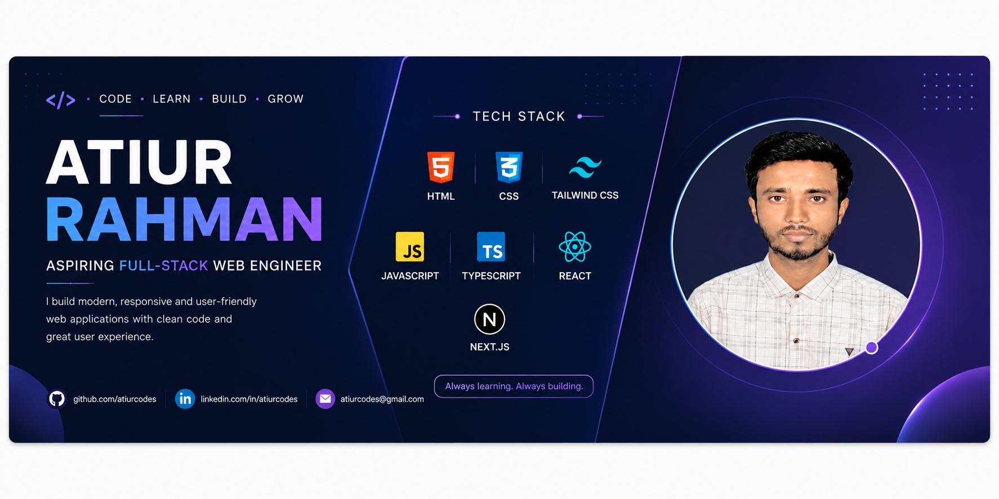

<!-- Header Banner -->

  

<h1 align='center'>Hi 👋, I'm Atiur Rahman</h1>
<h2 align='center'>Aspiring Full-Stack Web Engineer 🚀</h2>

  📍 <strong>Birganj, Dinajpur, Bangladesh</strong> &nbsp;|&nbsp;
  ✉️<a href="mailto:atiurcodes@gmail.com">atiurcodes@gmail.com
</a>

---

## 👨‍💻 About Me

Hi! I'm **Atiur Rahman**, a passionate web development learner who enjoys building modern, clean, and user-friendly web applications.

* 🎓 Currently learning Web Development through **Programming Hero — Batch 14**
* 💻 Building projects to strengthen my frontend and problem-solving skills
* 🧠 Improving my logical thinking through regular problem-solving practice
* 🚀 Currently focusing on **React.js, TypeScript, and Next.js**
* 🌱 Preparing to learn **Node.js, Express.js, and MongoDB**
* 🎯 My goal is to become a **Full-Stack AI-Powered Web Engineer**
* ⚡ I believe in learning consistently, building projects, and improving every day

---

## 🛠️ Skills & Technologies

### 🎨 Frontend

  

### 🔧 Tools & Platforms

  

### 🌱 Currently Learning

  

### Tools & Platforms

  
  
  
  

### 🌱 Currently Learning

  
  
  

---

## 🌐 Connect With Me

  

  

  

---

## 📊 GitHub Stats

  

  

---

## 📌 Featured Projects

I am continuously building projects to improve my development skills and gain practical experience.

### 🌐 Genflyo Website

A modern and responsive website built with **Next.js** and **Tailwind CSS**.

  🔗 <a href="https://genflyo-website.vercel.app/" target="_blank">Live Demo</a>
  &nbsp; | &nbsp;
  🔗 <a href="https://github.com/atiurcodes/genflyo-website" target="_blank">GitHub Repository</a>

**Tech Stack:** Next.js • React • Tailwind CSS • JavaScript

### 💼 Personal Portfolio

My personal portfolio website showcasing my skills, projects, and web development journey.

  🔗 <a href="https://nextjs-portfolio-pi-silk.vercel.app/" target="_blank">Live Demo</a>
  &nbsp; | &nbsp;
  🔗 <a href="https://github.com/atiurcodes/portfolio" target="_blank">GitHub Repository</a>

**Tech Stack:** Next.js • React • Tailwind CSS • JavaScript

### 🎨 HTML Project

A simple and responsive website built using **HTML5** and **CSS3**.

  🔗 <a href="https://atiurcodes.github.io/html-project/" target="_blank">Live Demo</a>
  &nbsp; | &nbsp;
  🔗 <a href="https://github.com/atiurcodes/html-project" target="_blank">GitHub Repository</a>

**Tech Stack:** HTML5 • CSS3

---

## 🎯 2026 Goals

* 🚀 Become a strong Full-Stack Web Engineer
* ⚛️ Build more real-world React and Next.js projects
* 🧩 Improve problem-solving and algorithmic thinking
* 🌐 Learn backend development with Node.js, Express.js & MongoDB
* 🤖 Explore AI-powered web development
* 💼 Become job-ready and start my professional career

---

### 💙 Thanks for visiting my profile!

**Learning • Building • Improving • Every Day 🚀**

